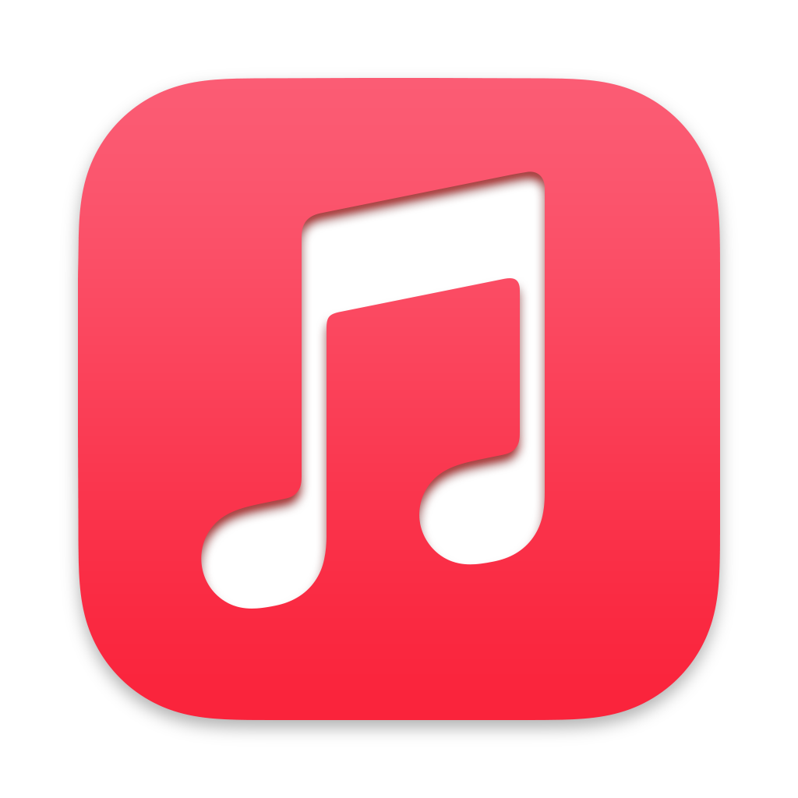
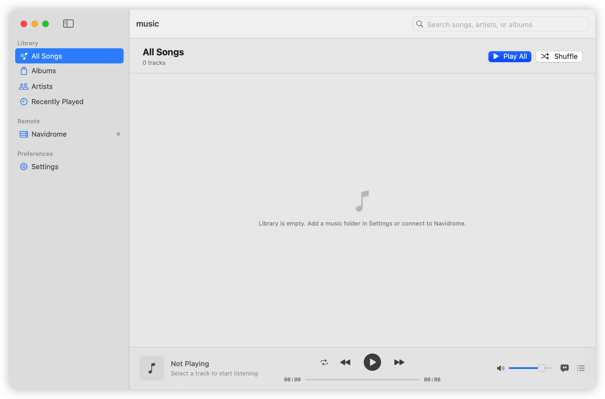
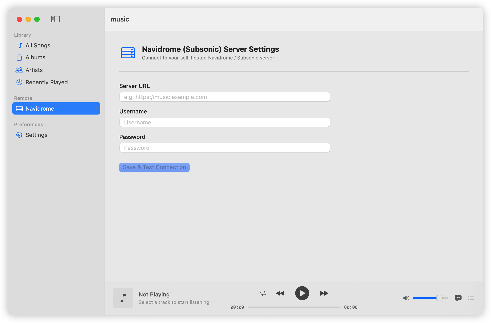
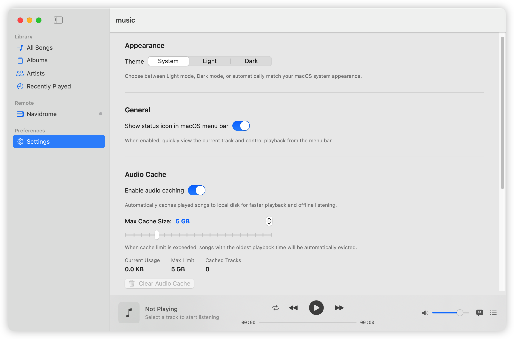

<div align="center">
  

  <br />

  # music for macOS

  _A minimalist, lightweight, and native music player for local libraries and self-hosted Navidrome._

  [](https://www.apple.com/macos/)
  [](https://swift.org)
  [](LICENSE)

</div>

---

## 💡 Why This Project Exists

This is a **purely personal project** born out of my own everyday frustration.

For years, I loved the **Library** feature in Apple Music—the way it organizes an album collection is second to none. But over time, the friction became unbearable:
- **Disappearing Songs & License Issues**: Tracks would frequently vanish or turn gray without warning, an issue especially rampant in the mainland China region. Eventually, I found myself hunting down audio files and uploading them manually, treating Apple Music essentially as a paid personal music locker.
- **Import Only, No Export**: As a music drive, it only allows importing, never exporting. I never felt true ownership or control over my own library.
- **Tightly Coupled to App Store Accounts**: I occasionally need to switch App Store regions to install different applications. But in Apple Music, changing your App Store Apple ID immediately wipes or disables your music library and offline downloads.

Fed up with these limitations, I began searching for alternatives, prioritizing **open-source** and **self-hosted** solutions, which eventually led me to **Navidrome**.

On mobile (iOS), I quickly found great third-party clients. On macOS, however, I searched everywhere and couldn't find anything **lightweight, clean, and distraction-free**:
- I simply wanted to listen to my own library. Most existing clients were packed with extra bells and whistles I never used.
- Nearly all of them were built on cross-platform frameworks like Electron. After running for a while, memory usage would easily creep toward 1 GB—far too bloated and heavy for a music player.

Out of necessity, I spent a single day building this native macOS app with **Swift + SwiftUI**. I am by no means a macOS client development expert; **over 80% of the code was written by AI**, while I focused on defining requirements, steering architecture, and testing edge cases.

---

## 🖼️ Screenshots

<div align="center">
  
  <p><em>Navidrome server integration and compact floating Mini Player</em></p>
  <br />

  
  <p><em>Synced LRC lyrics playback with native macOS bottom player bar</em></p>
  <br />

  
  <p><em>Main Library: Clean NavigationSplitView for browsing songs, albums, and artists</em></p>
</div>

---

## 🎯 Design & Trade-offs

This player is not intended to please everyone. Its boundaries are deliberately narrow:

- **Strictly Local & Navidrome**: It only plays local audio files and connects to self-hosted Navidrome (Subsonic) servers. There are no commercial streaming recommendations or discovery features. It is **not** suitable for anyone looking for online streaming services.
- **Intentionally Minimal**: The UI and features are kept as simple as possible, retaining only what is strictly necessary to enjoy listening to music.
- **Extremely Low Resource Footprint**: Free of cross-platform overhead, on my library of **500+ songs** running on a **MacBook Pro (M3 Pro)**, memory consumption consistently stays **below 100 MB** during extended playback, with near-zero CPU impact.

---

## ⚠️ Compatibility & Disclaimer

- **Personal Experiment**: This app was built solely to suit my personal preferences and daily listening workflow.
- **Testing Scope**: The project has not undergone comprehensive usability or regression testing across diverse devices and legacy OS versions. It is **only guaranteed to run properly on macOS 15 (Sequoia) and later**.

---

## 🛠️ Building & Running

### Option 1: Automated GitHub Actions (Recommended)
This repository includes a CI pipeline (`.github/workflows/macos-build.yml`):
1. Every commit pushed to `main` triggers an automated build and test run on `macos-15`.
2. You can download the pre-packaged `.app` zip bundle directly from the **Actions** tab artifacts.

### Option 2: Build Locally (macOS 15+)
Requires Xcode 16+ and Command Line Tools.

```bash
# 1. Clone the repository
git clone git@github.com:eidnoat/music4mac.git
cd music4mac

# 2. Run unit tests
swift test

# 3. Build and package music.app
./build_app.sh

# 4. Or open directly in Xcode
open Package.swift
```

---

## 📄 License

This project is licensed under the [MIT License](LICENSE).
